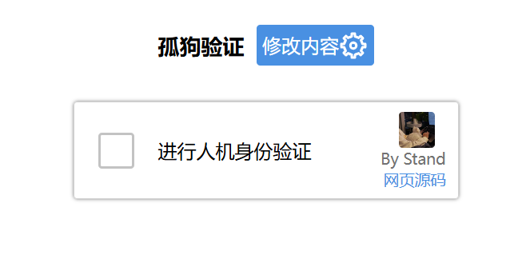

## 孤狗验证

一个原生html实现可自定义的仿谷歌验证页面（组件？

## 实现功能

- 假的加载动画
- 空白处关闭验证层
- 图片选择和取消选择
- 验证错误提示
- 成功动画
- 修改各种信息（验证文字、图片）

## 演示地址

[周常临.run](https://xn--miqz4ml5i.run/gugo)

## 开发参考

- 打钩动画：https://ylface.com/web/1465.html
- 加载动画：https://codepen.io/camdenfoucht/pen/BVxawq
- 图标来源：https://iconpark.oceanengine.com/

## 开源协议

本项目采用MIT协议
